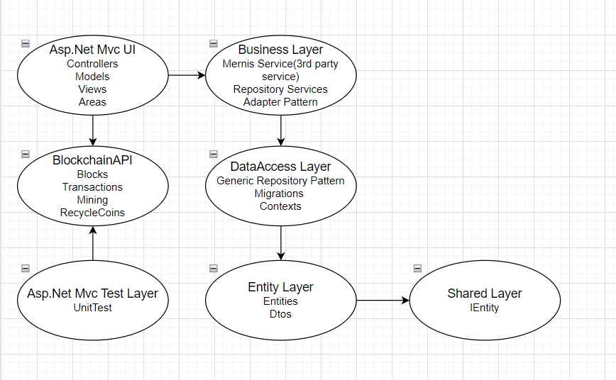

<h1>Recycle Coin Project</h1>

In the project, users recycle the waste they have collected and earn carbon in return. They convert these carbons into recycle coins. This project is inspired by the blockchain system. Users have accounts in the project. There are blocks where these accounts are kept safe. Users mine by performing transactions in these accounts.

<h3>1.Project Requirements</h3>
<ul>
    <li>Let each object have its own conversion score. For example: 50 carbon for a 0,5lt plastic bottle, 150 carbon for a 1,5lt plastic bottle, 330 carbon for a 0,33 aleminium coke can, 25 carbon for a 1 newspaper, etc. (The data can be stored in a DB).
    </li>
    <li>Each person who joins the system will have their own SHA-256 address and Recycle Coin assignment can be performed at this address. 1 Recycle Coin (RC) = 100,000,000 Carbon (C).
    </li>
    <li>Recycle Coin value will be generated by mining. Limit the total amount of Recycle Coins to 100,000,000.
    </li>
    <li>Each user can see the value of Recycle Coin in their account and can transfer as much as they want to another user
    </li>
</ul>

<h3>2.Used Technologies</h3>
Asp.Net Mvc ,EntityFramework,An api written in Python, An api written in Node.js,MongoDb,MySQL,Basic Architecture, TC authentication with Mernis Service,Css,Html,JavaScript
 
<h3>3.General Outlines of the Architecture Used in the Project</h3>

  
<b>Note:</b> The project was developed together with my dear friend Muhammed Mustafa Uçar.
The blockchain-related transactions of the project are available in the link below. 

https://github.com/Mstfucrr/Javascript-Blockchain 

 

You can find the actual commit information at https://github.com/Mstfucrr/CSharp-Blockchain-Project-MVC.

